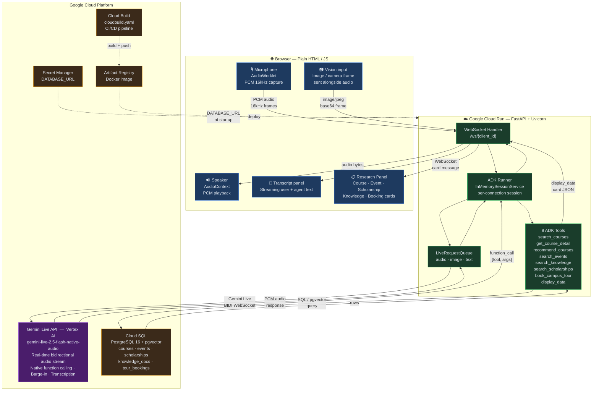

# Waypoint — Architecture Diagram

Paste the Mermaid block below into https://mermaid.live to render and export as PNG.

---

---

## Key flows to call out in the Devpost story

| Flow | Description |
|------|-------------|
| **Audio in** | Browser AudioWorklet captures mic at 16kHz PCM → WebSocket → LiveRequestQueue → Gemini Live BIDI stream |
| **Audio out** | Gemini streams PCM back → ADK Runner → WebSocket → Browser AudioContext plays in real time |
| **Tool execution** | Gemini emits `function_call` → ADK Routes to correct tool → Tool queries Cloud SQL via pgvector → Result returned to Gemini |
| **Card side-channel** | Tools call `display_data` → JSON sent directly over WebSocket → Browser renders structured card without waiting for Clara to finish speaking |
| **Vision input** | Browser captures image frame → sent as `image/jpeg` blob alongside audio via LiveRequestQueue → Gemini processes multimodally |
| **CI/CD** | `git push` → Cloud Build triggers → Docker image pushed to Artifact Registry → Cloud Run deploys new revision |
